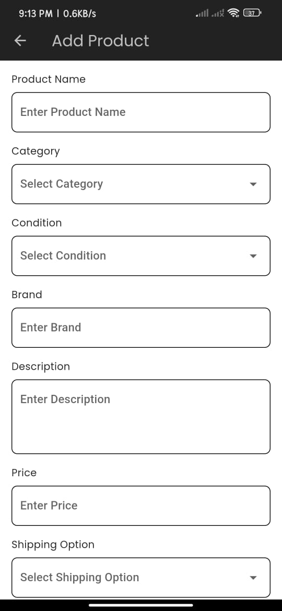

# 🧠 AI-Driven Multi-Mode Marketplace App – FYP Project

A full-stack solution combining a **Flutter mobile app** (iOS & Android) and a **Flutter web-based admin panel**, powered by AI/ML for smart shopping, worker verification, and virtual try-on.

---

## 🧩 Project Overview

This project is built as a Final Year Project (FYP) to solve real-world problems by merging **marketplace functionality** with **AI-based automation**. It features three distinct user roles and a centralized admin panel.

---

## 🚀 Features

### 👥 Multiple User Modes
- **Buyer Mode**: Browse products, use image-based search, and try on clothes virtually.
- **Seller Mode**: Upload and manage products, track orders.
- **Worker Mode**: Apply for jobs with **AI-verified identity** (ID card + face match).

### 🛍️ AI-Powered Shopping Experience
- **Image-Based Search**: Upload an image to find similar products using **MobileNet (TFLite)**.
- **Virtual Try-On**: Try clothes before buying with **Xthan VITON** and **PA-AFN** models integrated into the app.

### 🧑‍🔧 Worker Verification System
- **ID Card Scanning** with OCR
- **Face Matching with ID** using AI models
- Verifies real identity and eligibility of workers

### 🖥️ Admin Panel (Flutter Web)
- Manage users (buyers, sellers, workers)
- Review and approve worker identities
- Moderate products, complaints, and usage analytics

---

## 🧰 Tech Stack

### 💻 Frontend
- **Flutter** (mobile for iOS + Android)
- **Flutter Web** (admin panel)

### ☁️ Backend & Services
- **Firebase** (Firestore, Auth, Storage)
- **Cloudinary** – image storage
- **REST APIs** for ML model interaction

### 🤖 AI / ML Models
| Feature | Model Used |
|--------|------------|
| Image-based product search | **MobileNet** (.tflite) |
| Virtual try-on | **Xthan VITON**, **PA-AFN** |
| Face & ID verification | Custom trained face matcher & ID OCR |

---

## 📸 Screenshots  

### 🏠 Home Page  


### ➕ Add Product  


### 🔍 Image-Based Search  


### 🛠️ Manage Services  


### 📊 Seller Dashboard  


### ⚙️ Settings  


### 🚀 Splash Screen  


---

## ⚙️ Getting Started

### 🧪 Prerequisites
- Flutter SDK
- Firebase project setup
- Python backend for AI models (optional but recommended for full demo)

### 🚀 Run Mobile App
```bash
git clone https://github.com/your-username/ai-marketplace-app.git
cd ai-marketplace-app
flutter pub get
flutter run
